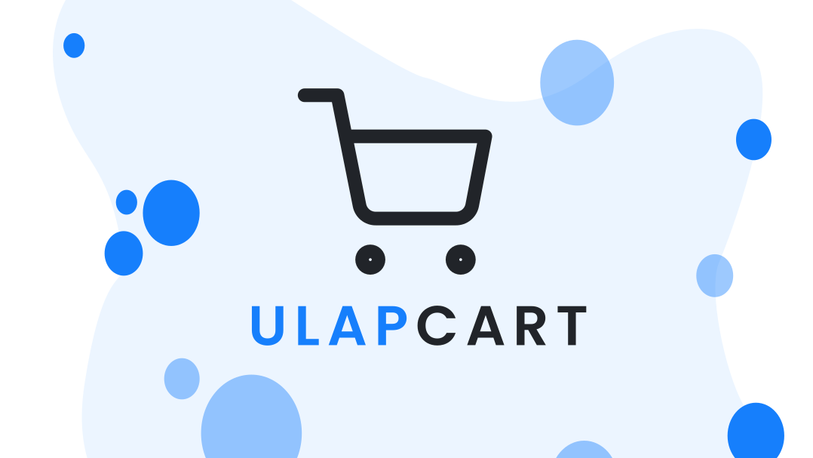

# **Ulap Cart** Ecommerce POC

Ulap Cart is an Ecommerce Proof of Concept (POC) that showcases the latest in design and technology. Developed by Criztain Dev, Ulap Cart is powered by the latest technology stack, MERN (MongoDB, ExpressJS, ReactJS, and NodeJS), which provides a robust and scalable foundation for the website's backend. The frontend is built using ReactJS, which ensures a seamless and intuitive user interface that is easy to navigate for customers. The website's sleek and modern appearance is due in part to the contributions of designer wardvisual, who helped create an intuitive and visually appealing user interface that makes it easy for customers to find what they need.

## **Contributing**

If you're interested in contributing to the development of Ulap Cart, don't hesitate to reach out to Criztain Dev. With their expertise in software development and ecommerce, as well as their dedication to creating a highly functional and visually appealing platform, Criztain is always looking for talented individuals to join the team. Whether you're a developer, designer, or ecommerce expert, there's a place for you on the Ulap Cart project.

Before making any contributions, please review the project's contributing guidelines to ensure that your work aligns with the project's goals and standards.

License
Ulap Cart is licensed under the MIT License. You are free to use and modify this software for any purpose, with or without attribution.
